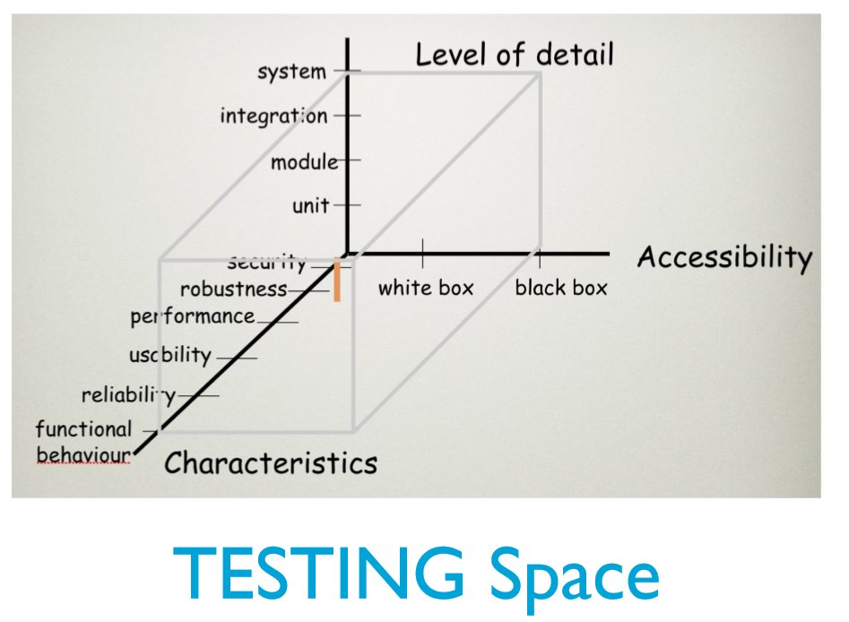

# 软件构造

软件构造除了核心的编程任务之外，还涉及详细设计(数据结构与算法设计)、单元测试、集成与集成测试、以及其他活动。

## 重构

修改软件系统的严谨方法，它在不改变代码外部表现的情况下改进其内部结构。

## 测试驱动开发

测试驱动开发要求程序员在编写一段代码之前，优先完成该段代码的测试代码。并在编程中重复执行测试代码，以验证程序的正确性。

## 结对编程

两个程序员挨着坐在一起，共同协作进行软件构造活动。

# 测试

> Are you building it “right”? `Validation`
>
> Are you building the “right” thing? `Verification`

## 概论

##  测试用例

### 差分测试

- 开发者：理解系统含义，但是只是大体上，通过流程进行了测试
- 独立测试人员：必须学习系统相关，但是会去尝试破坏系统，并且是通过质量来驱动测试

## 桩与驱动

1. `桩程序`是被测试部件的交互环境，他扮演被测试部件需要调用的其他系统部件。桩程序对其他系统部件的扮演仅限于规格相同，内部代码要简单的多，通常是直接返回固定数据或者按照固定规则返回数据。
2. `驱动程序`负责创建被测试部件的执行环境，并驱动和监控被测试部件执行测试用例的过程，判定测试用例的执行结果。

> `Stub`：代指那些包含了预定义好的数据并且在测试时返回给调用者的对象。Stub 常被用于我们不希望返回真实数据或者造成其他副作用的场景。
>
> `Mock`：代指那些仅记录它们的调用信息的对象，在测试断言中我们需要验证 Mocks 被进行了符合期望的调用。
>
> `Fake`：是那些包含了生产环境下具体实现的简化版本的对象。

## 测试空间

## 测试层次

开发者主要是进行`单元测试`，可以进行一定程度上的`集成测试`和`系统测试`。

### 重点

- `α测试`：在软件发布前，让小规模、有代表性的潜在用户试用，可以在开发机构中进行。
- `β测试`：在用户处进行

## 单元测试

1. 在`过程化编程`中，一个单元就是一个函数与过程。
2. 在`面向对象编程`中，一个单元就是类的一个方法。
3. 发现技术缺陷和代码缺陷

## 集成测试

集成测试一般在单元测试和系统测试之间。

### 自顶向下的集成测试

> 一定要一步一步集成

### 自底向上的集成测试

## 系统测试

## 测试技术

1. 测试的目的是发现尽可能多的缺陷，并不绝对要求发现所有缺陷。

### 测试用例的选择

> 课本P326页图 19-7 :工程追求足够好，而不是最好。

### 随机测试

比如int的越界问题：两类测试用例，不越界和越界

### 黑盒测试 ==重要==

1. 黑盒测试是将测试对象作为一个黑盒子，完全基于输入和输出数据来判断测试对象的正确性。

#### 等价类划分

- 把所有可能的输入数据，即程序的输入域划分为若干部分(子集)，从每个子集中选取少量具有代表性的数据作为测试用例。

#### 边界值分析

1. `边界值分析`是等价类划分方法的补充，实践证明，错误最容易发生在各等价类的边界，而不是等价类的内部。
2. 对定价类划分的补充，错误容易发生在各个等价类的边界上，而不是等价类的内部，因此针对边界情况设计测试用例，可以发现更多的缺陷。

#### 决策表

- 决策表是为复杂逻辑判断设计测试用例的技术。决策表示由条件声明、行动声明、规则选项和行动选项等四个象限组成的表格。

#### 状态转换

- `状态转换`是针对复杂测试对象的测试技术。该类复杂测试对象对输入数据的反映是多样的，还需要依赖自身的状态才能决定。
- `状态转换`包含有效转换和无效转换，只有在复杂情况和可靠性要求较高的情况下才会为无效转换设计测试用例。

##### 例子

### 白盒测试 ==重要==

`白盒测试`是将测试对象看做透明的，不关心测试对象的规格，而是按照测试对象内部的程序结构来设计测试用例进行测试工作。

#### 语句覆盖

语句覆盖设计测试用例的标注是保证被测试的对象的每一行代码都至少执行了一次。

### 特定测试技术

### 面向对象的测试技术

## 测试活动

1. `测试计划`：在开始具体的软件测试活动之前，必须首先进行测试计划，以明确测试的工作范围、资源与成本、基本策略、进度安排等。
2. `测试设计`：测试的成功取决于有效设计的测试用例
3. `测试执行`：执行测试前需要选择好测试工具
4. `测试评价`：在测试完成后，必须评价测试结果
5. 以上详见课本332页

## 测试用例日志

## 缺陷报告

## 测试度量

- `需求覆盖率 `= `被测试`的`需求数量` / `需求总数`
- `模块覆盖率 `= `被测试`的`模块数量` / `模块总数`
- `代码覆盖率` = `被测试`的`代码行` / `代码行数`

### 缺陷度量

### 覆盖率

