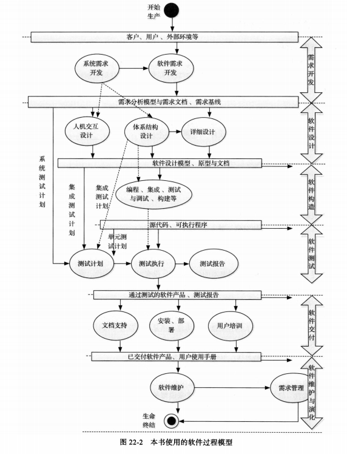
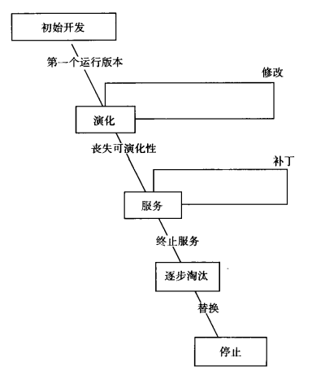
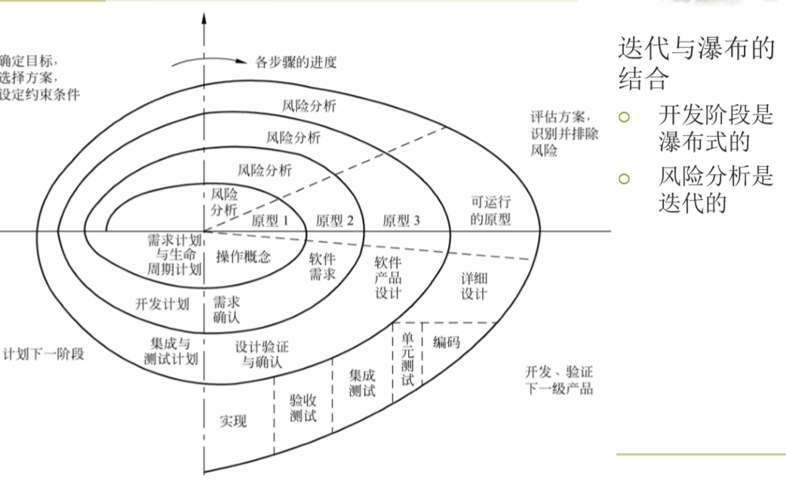
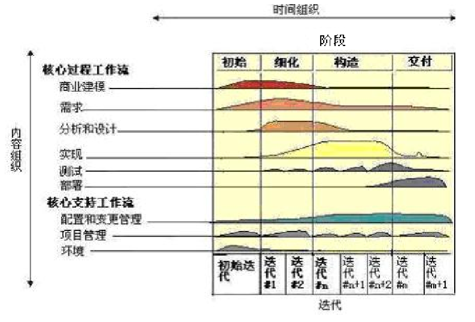
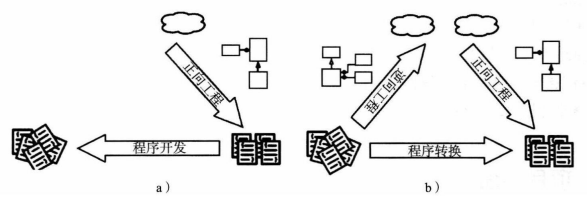
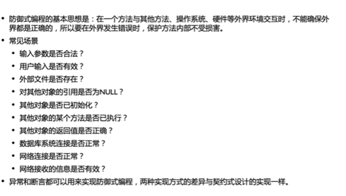

# 软件工程

## 定义

1）应用系统的、规范的、可量化的方法来开发、运行和维护软件，即将工程应用到软件。

2）对1)中各种方法的研究。

## 软件生命周期模型

## 软件过程模型

## 软件演化生命周期模型

人们将软件从**生产到报废**的生命周期分割为不同阶段，每段阶段有明确的典型输入/输出、主要活动和执行人，各个阶段形成明确、连续的顺次过程，这些阶段划分就被称为软件生命周期模型。

### 步骤

1. 初始开发
2. 演化
3. 服务
4. 逐步淘汰
5. 停止

### 优点：

- 使用了迭代式开发，具有更好的适用性、尤其是其演化式迭代安排能够适用于那些需求变更比较频繁或不确定性较多的软件系统的开发
- 并行开发可以帮助缩短软件产品的开发时间
- 渐进交互可以加强用户反馈，降低开发风险

### 缺点：

- 无法在项目早期阶段确定项目范围，所以项目的整体计划、进度调度、尤其是商务协商事宜无法准确把握
- 后续迭代的开发活动是在前导迭代的基础上进行修改和扩展的，这容易让后续迭代忽略分析与设计工作，蜕变为构建——修复方式
- 如果缺乏过程管理，可能会陷入试——错——改的循环

> 以下是具体的演化模型

## 构建-修补模型

最早也是最自然产生的软件开发模型，对软件开发活动没有任何规划和组织，是完全依靠开发人员个人能力进行软件开发的方式。

### 缺点

1. 在这种模型中，没有对开发工作进行规范和组织，所以随着软件系统的**复杂度提升**，开发活动会超出个人的直接控制能力，构建-修复模型就会导致开发活动无法有效进行而失败；
2. 没有分析**需求的真实性**，给软件开发带来很大的风险；
3. 没有考虑**软件结构的质量**，使得软件结构在不断的修改中变得质量越来越糟，直至无法修改；
4. 没有考虑测试和程序的可维护性，也没有任何文档，软件的维护十分困难。

适用于软件规模很小的软件。

## 瀑布模型

瀑布模型是按照软件生命周期模型将软件开发活动组织为需求开发、软件设计、软件实现、软件测试、软件交付和软件维护等活动，并且规定了它们自上而下、相互邻接的次序。

### 优点

为软件开发活动定义了清晰的阶段划分(包括输入/输出、主要工作及其关注点)，这让开发者能够以关注点分离的方式更好地进行那些复杂度超越个人能力的软件项目的开发活动。

### 缺点

1. 对文档的过高的期望具有局限性
2. 对开发活动的线性顺序假设具有局限性
3. 客户、用户的参与具有局限性：成功的项目开发需要客户、用户从始至终的参与，而不仅仅是一个阶段。
4. 里程碑粒度具有局限性：里程碑粒度过粗，基本丧失了"早发现缺陷早修复"这一思想

适用于比较成熟，没有技术难点的软件。

## 增量迭代模型（需求驱动)）

增量迭代模型是在项目开始时，通过系统需求开发和核心体系结构设计活动完成项目对前景和范围的界定，然后再将后续开发活动组织为多个迭代、并行的瀑布式开发模型。需求驱动。

少量的不确定性和影响不大的需求变更通过迭代的方式加以解决 

### 优点

1. 迭代式开发更加符合软件开发的实践情况，具有更好的适用性；
2. 并行开发可以帮助缩短软件产品的开发时间；
3. 渐进交付可以加强用户反馈，降低开发风险。

### 缺点

1. 由于各个构件是逐渐并入已有的软件体系结构中的，所以加入构件必须不破坏已构造好的系统部分，这需要软件具备开放式的体系结构。
2. 增量交付模型需要一个完备、清晰的项目前景和范围以进行并发开发规划，但是在一些不稳定的领域，不确定性太多或者需求变化非常频繁，很难在项目开始就确定前景和范围。

适用于大规模软件系统的开发。

## 演化模型

演化模型将软件开发活动组织为多个迭代、并行的瀑布式开发活动。演化模型能够更好地应对需求变更，更适用于需求变更比较频繁或不确定性较多的领域

### 优点

1. **使用了迭代式开发，具有更好的适用性**，尤其是其演化式迭代安排能够适用于那些需求变更比较频繁或不确定性较多的软件系统的开发；
2. 并行开发可以帮助**缩短**软件产品的开发时间；
3. 渐进交付可以**加强用户反馈**，降低开发风险。

### 缺点

1. 无法在项目早期阶段建立项目范围，所以项目的整体计划、进度调度、尤其是商务协商事宜无法准确把握；
2. 后续迭代的开发活动是在前导迭代基础上进行修改和扩展的，这容易让后续迭代忽略设分析与设计工作，蜕变为构建-修复方式。

适用与不稳定领域的大规模软件系统开发

## 原型模型

原型模型将需求开发活动展开为抛弃式原型开发活动和演化式原型开发活动。原型模型在整体安排迭代的情况下，强调"**抛弃式原型**"的演化模型。抛弃式原型解决对未来知识的局限性产生的**不确定性**，将未来置于现在进行推敲。

### 抛弃式原型

1. 它通过模拟"未来"的产品，将"未来"的知识置于"现在" 进行推敲，解决不确定性。
2. 存在的原因是"不确定的"，这一类原型在后续的开发过程中会被抛弃

### 演化式原型

1. 在迭代中构建，是系统的核心，并不断扩充，最终成为真正的软件产品。
2. 它将作为真正产品的一部分，所以必须有很好的质量。在迭代式开发中，通常会在第一个迭代中构建一个核心的体系结构演化式原型，并且在后续迭代中不断扩充，成为真正的软件产品。

### 优点：

1. 对原型方法的使用加强了与客户、用户的交流，可以让最终产品取得更好的满意度；
2. 适用于非常新颖的领域，这些领域因为新颖所以有着大量的不确定性。

### 缺点

1. 原型方法能够解决风险，但是自身也能带来新的风险，例如原型开发的成本较高，可能会耗尽项目的费用和时间；
2. 实践中，很多项目负责人不舍得抛弃"抛弃式原型"，使得质量较差的代码进入了最终产品，导致了最终产品的低质量。

适用于具有大量不确定的新颖领域进行开发活动组织。

## 螺旋模型

螺旋模型是风险驱动的，完全按照风险解决的方式组织软件开发活动。

### 过程

1. 确定目标、解决方案和约束
2. 评估方案，发现风险
3. 寻找风险解决方法
4. 落实风险解决方案
5. 计划下一个迭代

### 意义

自内向外，螺旋模型有4次风险解决迭代，分别解决了几个高风险的阶段的问题

1. 解决系统需求开发中的风险，尤其是产品概念设计风险，得到一个确定的产品前景和范围。
2. 解决软件需求开发中的风险，得到清晰的软件需求
3. 解决软件体系结构设计中的技术风险，构建高质量的核心体系结构原型。
4. 解决详细设计和实现中的关键技术风险，建立一个可实现的高质量软件结构。

### 优点

可以降低风险，减少项目因风险造成的损失

### 缺点

1. 风险解决需要使用原型手段，也就会存在原型自身带来的风险，这一点与原型模型相同；
2. 模型过于复杂，不利于管理者依据其组织软件开发活动

1. 适用于高风险的大规模软件系统开发

## RUP模型

统一过程(Rational Unified Process，RUP)总结和借鉴传统上的各种有效经验，建立最佳实践方法的集合，并提供有效的过程定制手段，允许开发者根据特定的需要定制一个有效的过程模型。

### 实践方法

1. 迭代式开发，这是过去被反复证明的最佳实践方法；
2. 管理需求，重视需求工程中除了需求开发之外的需求管理活动；
3. 使用基于组件的体系结构，它帮助建立一个可维护、易开发、易复用的软件体系结构；
4. 可视化建模，利用UML进行建模；
5. 验证软件质量，尽早和持续地开展验证，以尽早发现缺陷，降低风险和成本；
6. 控制软件变更，适应1990s以后需求变更越来越重要的事实。

### 优点

1. 吸收和借鉴了传统上的最佳实践方法，尤其是其核心的6个实践方法，能够保证软件开发过程的组织是基本有效和合理的。
2. RUP依据其定制机制的不同，可以适用于小型项目，也可以适用于大型项目的开发，适用面广泛。
3. RUP有一套软件工程工具的支持，这可以帮助RUP的有效实施。

### 缺点

1. 没有考虑交付之后的软件维护问题
2. 裁剪和配置工作不是一个简单的任务，无法保证每个项目都能定制一个有效的RUP过程。

适用：RUP是重量级过程，能够胜任大型软件团队开发大型项目时的活动组织。但RUP经过裁剪和定制，也可以变为轻量级过程，也能够胜任小团队的开发活动组织。

## 敏捷模型(XP)

最为重要的敏捷思想是敏捷联盟宣言所声明的价值观：

1. 个体和互动 ==高于== 流程和工具
2. 工作的软件 ==高于== 详尽的文档
3. 客户合作 ==高于== 合同谈判
4. 响应变化 ==高于== 遵循计划

极限编程，就是什么最有效果就做什么。

适用于快速变化或者时间压力较大的项目。

## 逆向工程

逆向工程技术是指："分析目标系统，标识系统的部件及其交互关系，并且使用其它形式或者更高层的抽象创建系统表现的过程[Chikofsky1990]"。

处理遗留软件时，维护人员接受的维护对象可能是一个没有任何文档也没有程序源代码的软件程序，此时，维护人员需要使用逆向工程技术。

逆向工程的基本原理是抽取软件系统的需求与设计而隐藏实现细节，然后在需求与设计的层次上描述软件系统，以建立对系统更加准确和清晰的理解。

## 再工程

[Arnold1993]认为再工程主要是下列两类活动：

1. 改进人们对软件的理解
2. 改进软件自身，通常是提高其可维护性、可复用性和可演化性

常见的具体活动有

1. 重新文档化
2. 重组系统的结构
3. 将系统转换为更新的编程语言
4. 修改数据的结构组织。

是抽象出来一个视图，然后完全重新开始开发，而不是基于逆向工程得到的结果进行再工程。

# 五十年代到00年代的特点

## 1950s

科学计算；以机器为中心进行编程；像生产硬件一样生产软件。

## 1960s

业务应用(批量数据处理和事物计算)；软件不同于硬件；用软件工艺的方式生产软件。

## 1970s

结构化方法；瀑布模型；强调规则和纪律。它们奠定了软件工程的基础，是后续年代软件工程发展的支撑。

## 1980s

追求生产力最大化；现代结构化方法/面向对象编程广泛应用；重视过程的作用。

## 1990s

企业为中心的大规模软件系统开发；追求快速开发、可变更性和用户价值；web应用出现

## 2000s

大规模web应用；大量面向大众的web产品；追求快速开发、可变更性、用户价值和创新。

# 团队

## 分类

1. 主程序员团队
2. 民主团队
3. 开放团队

##  团队建设

1. 建立团队章程
2. 持续成功
3. 和谐沟通
4. 不断总结
5. 避免团队杀手
   1. 防范式管理
   2. 官僚主义
   3. 地理分布：异地办公
   4. 时间分割：保证全天候有人在
   5. 产品质量的降低
   6. 虚假的最后期限
   7. 小圈子管理

# 质量保障

## 措施

1. `需求开发`：需求评审和需求度量；
2. `体系结构`：体系结构评审和集成测试(持续集成)；
3. `详细设计`：详细设计评审、设计度量和集成测试(持续集成)；
4. `构造阶段`：代码评审、代码度量、测试(测试驱动和持续集成)；
5. `测试阶段`：测试、测试度量。
6. `要及时的根据保障计划进行质量验证`，质量验证的方法主要有**评审**、**测试**和**质量度量**三种。

# 配置管理

1. `标识配置项`：确定应该被保留的部分，并且给予他们确定标识，包含配置项的特征，包括生产者、基线建立时间、使用者等。
2. `版本管理`：极其重要
3. `变更控制`：变更请求表单，教材61页
4. `配置审计`：验证配置项的完整性、正确性、一致性和可追踪性。
5. `状态报告`：反映当前的配置状态。
6. `软件发布管理`：将配置项发布到开发活动之外，例如发布给客户。

# 代码改进

## 基本要素

- 简洁性/可维护性

- 使⽤数据结构消减复杂判定

- 控制结构

- 变量使⽤

- 语句处理

- How to write unmaintainable code

- 防御与错误处理

## 契约式编程

1. 使用异常或断言的方式检查
2. 检查中间的过程

## 防御式编程

1. 前置和后置方法

## 代码复杂度

#  软件维护

> 软件维护是在交付之后修改软件系统或其部件的活动过程，以修正缺陷、提高性能或其他属性、适应变化的环境。

## 重要性

1. 主要是为了保证产品的正常运转而进行使用帮助、故障解决和磨损处理等工作。
2. 软件维护是在交付之后修改软件系统或其部件的活动过程，以修正缺陷、提高性能或其他属性、适应变化的环境。问题、环境发生了改变，软件产品中存在缺陷。
3. 软件的维护主要是"修改"。软件不会磨损，软件维护只需要完成少量的使用帮助、故障解决和磨损处理等工作，软件特性上是易于修改的，软件只有持续修改才能保持价值。

## 方法

1. 前期(开发阶段)更充分的准备可以减轻后期维护的压力与困难
2. 考虑到软件的可变更性进行开发

## 过程

1. 问题/修改的标识、分类与划分优先级
2. 分析
3. 设计
4. 实现
5. 回归测试：修改后不会影响
6. 验收测试
7. 移交

## 用户文档和系统文档

### 用户文档

1. 用户文档是指为用户编写参考指南或者操作教程，常见的如用户使用手册、联机帮助文档等，统称为用户文档。
2. 文档内容的组织应当支持其使用模式，常见的是指导模式和参考模式两种。

#### 要素

1. 标识信息
   1. 包括文档标题、文档产生的版本和日期、相关的软件 产品和版本
   2. 标识信息应该放在包装袋或者封面，用户可以不用翻阅文档就能看到
2. 引言
   1. 正文的第一部分，描述文档的预期读者、描述范围，以及对文档目的、功能和操作环境的概要描述
3. 文档使用信息
   1. 文档使用信息描述了关于文档的使用信息，例如，解释各种图示的含义、介绍如何使用帮助等。
4. 操作模式
   1. 操作模式是使用用户文档的模式，例如对操作流程的图示或者文字性描述，再例如解释操作的理论、原因、算法或者通用概念。
5. 操作规程
   1. 指导模式文档应该包括很多软件功能都会涉及的常见活动规程：
      1. 需要由用户执行的软件安装与卸载
      2. 图形用户界面特性的使用指导
      3. 访问、登录或者关闭软件
      4. 通过软件的导航，访问和退出相关功能
      5. 数据操作(输入、保存、读取、打印、更新和删除)
      6. 取消、中断和重启操作的方法
   2. 对于完成用户任务的操作流程，指导模式文档应该从基本信息、指导步骤和结束信息三个方面来描述
   3. 基本信息：
      1. 简要概述操作规程的目的，定义或解释必要的概念
      2. 标明执行任务前需要完成的技术活动
      3. 列举用户完成任务所需要的资源情况，例如数据、文档、密码等
   4. 对于完成用户任务的操作流程，指导模式文档应该从基本信息、指导步骤和结束信息三个方面来描述
   5. 指导步骤：使用祈使语句描述用户行为，并指出预期的结果。指导步骤要说明：
      1. 用户输入数据的域值范围、最大长度和格式
      2. 相应的错误消息和恢复办法
      3. 其它可选的步骤和重复步骤
   6. 对于完成用户任务的操作流程，指导模式文档应该从基本信息、指导步骤和结束信息三个方面来描述
   7. 结束信息：标明操作规程的最后步骤，让用户知道怎样判断整个操作规程的成功完成，告诉用户如何退出操作规程
6. 软件命令信息
   1. 解释用户输入命令的格式和操作规程，包括必要参数、可选参数、缺省值等，要示例说明命令的使用，说明怎样判断命令是成功完成还是异常中止
7. 错误信息与问题解决
   1. 文档要详细描述软件使用中的已知问题，让用户清楚如何自行解决问题或者怎样向技术支持人员报告准确的信息
8. 导航特征
   1. 包括章节、主题、页码、链接、图标等
   2. 提高导航特征和效率

### 系统文档

与用户文档注重系统使用细节不同，系统管理员文档更注重系统维护方面的内容，例如系统性能调整、访问权限控制、常见故障解决等等。因此，系统管理员文档需要详细介绍软硬件的配置方式、网络连接方式、安全验证与访问授权方法、备份与容灾方法、部件替换方法等等。

