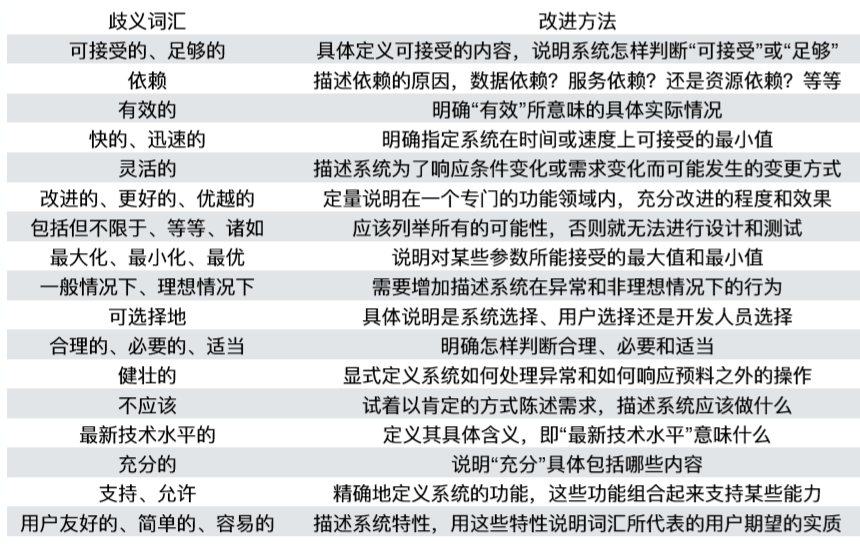

# 规格说明

## 作用

1. 方便交流：软件开发过程中，**子任务与人员**之间存在错综复杂的关系，存在大量的沟通和交流，所以要编写软件开发中要编写不同类型的文档，每种文档都是针对项目中需要广泛交流的内容。因为**软件需求**需要进行**广泛交流**，所以要把需求文档化。
2. 跟踪和度量：需求规格说明是在**软件产品的角度以系统级需求列表的方式**描述软件系统解决方案，书写需求规格说明，可以建立管理控制的基线，方便任务分配，制定工作计划，进行跟踪和度量。
3. 过程管理：在实验中，需求规格的重要性不只体现在结果上，还包括中间过程，在书写需求规格过程中，才真正把问题域的问题和分析模型的成果转化为系统级需求，方便小组成员真正明确需求，个人认为在这个阶段包含一部分的需求在发现和完整化。

## 写作要点

> 简洁，精确，易读，易修改；

### 技术文档要点

#### 简洁

动词名词+辅助词，不要使用复杂长句、形容词和副词。

#### 精确

语言不能产生歧义或导致人无法理解。

#### 易读

有效使⽤引言、目录、索引等能够增强⽂档易读性的⽅法，使⽤系统化的方式组织内容信息，提供⽂档内容的可读性。

#### 易修改

使用相同的语句格式组织相关联或相似的信息；使用列表组织独立、并列的信息；使用编号表达繁杂信息之间的关系。引用而不是重复

### 需求规格说明文档书写要点

> 使用用户术语，可验证，可行性；

- 充分利用标准的文档模板，保持所有内容位置得当；
- 保持文档内的需求集具有完备性和一致性；
- 为需求划分优先级

