# 软件设计

## 定义

1. 软件设计是指关于软件对象的设计，是一种设计活动。软件设计既指软件对象实现的规格说明，又指这个规格说明产生的过程。
2. 软件设计活动以需求开发的制品(需求规格说明和分析模型)为基础，构建软件设计方案描述和原型，为后期的构造活动提供规划或蓝图。
3. 软件设计兼具工程性和艺术性，由于软件系统的可变性，软件设计具有演化性，也因为软件设计的过程实际上就是一系列决策发生的过程，软件设计具有决策性。

## 核心思想

### 分解

横向上将系统分割为几个相对简单的子系统与子系统之间的关系

### 抽象

在纵向上聚焦个子系统的接口(这里的接口与实现相对)，可以分离接口和实现，使得人们更好的关注软件系统本质，降低复杂度。

## 核心层次

### 高层设计

高层设计基于反映软件高层抽象的构件设计，描述系统的高层结构、关注点和设计决策。

1. **部件**承载了系统主要的**计算与状态**
2. **连接件**承载部件之间的**交互**
3. 部件与连接件都是抽象的类型定义(就像类定义)，它们的实例(就像类的对象实例)组织构成软件系统的整体结构，**配置**将它们的实例连接起来

### 中层设计

中层设计更加关注组成构件的模块的设计、导入/导出、过程之间调用关系或者类之间的协作，模块划分**隐藏**⼀些程序片段(数据结构+算法)的细节，暴露接口于外界。

### 低层设计

低层设计深入模块和类的内部，关注具体的数据结构、算法、类型、语句和控制结构等。

# 详细设计

## 详细设计的出发点

软件详细设计是在软件体系结构设计之后进行，以需求开发的结果(需求规格说明和需求分析模型)和软件体系结构的结果(软件体系结构设计方案与原型)为出发点。

## 职责

### 定义

职责是执行任务(操作职责)或维护某些数据(数据职责)的义务。我们可以通过职责建立静态设计模型。

### 行为职责和数据职责

1. 行为职责通常由行为来履行。
2. 数据职责通常由属性来完成。
3. 可能会涉及到类之间的协作。

### 行为职责和属性职责

1. 属性职责:对象的状态
2. 行为职责:对象的行为

## 职责分配

> 将比较大的职责给很多对象。

### GRASP原则（通用职责分配软件模式）

> General Responsibility Assignment Software Pattern

#### 特点

- `低耦合`：分配一个职责要保证低耦合度。

- `高内聚`：分配一个职责的时候要保持类的高聚合度。

- `信息专家`：将一个职责分配给专家-履行职责所必须的信息的类，统一提供对外的接口，而不是某一个具体的接口，数据和行为不要分开。

- `创建者`：详见`创建规则`。

- `控制者`：详见`控制规则`(避免大多数信息由一个类发出、组件相对较小、行为职责和数据绑定、职责单一)。

#### 拇指原则

研究出来良好内聚性、耦合性和稳定性的替代方案。

#### 创建规则

如果有以下情况，则由创建者分配给`B类`创建`A类`实例的职责：

1. B 聚集了 A 对象
2. B 包含了 A 对象
3. B 记录了 A 的实例
4. B 要经常使用 A 对象
5. 当 A 的实例被创建，B具有传递给A的初始化数据(也就是 B 是创建 A 的实例这项任务的信息专家)
6. 在有选择的地方，更喜欢B聚合或包含A对象

|                             |                                                              |
| --------------------------- | ------------------------------------------------------------ |
| 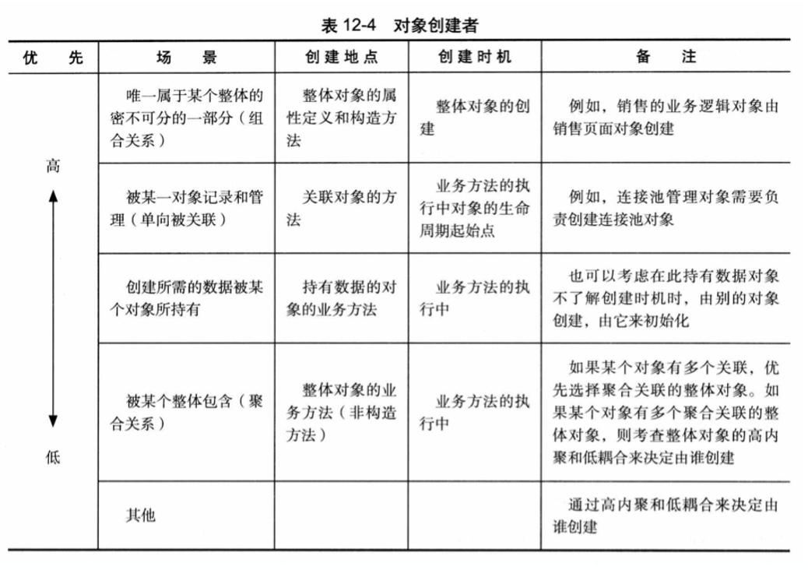 | ==组合==关系；<br>单向被==关联==（不用可归还）；<br>持有必要数据（根据实际情况）；<br>==聚合==关系（情况复杂，需要等待时机） |

## 协作

### 定义

程序中的对象互相协作，完成一个较大的职责。我们通过协作建立动态设计模型

### 协作的测试

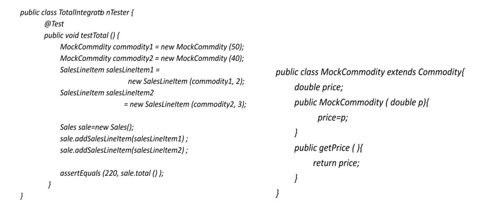

1. Mock Object类似于Stub，但是更加简单

### 集成测试

`Fake` 是那些包含了生产环境下具体实现的简化版本的对象；

`Stub` 代指那些包含了预定义好的数据并且在测试时返回给调用者的对象。Stub 常被用于我们不希望返回真实数据或者造成其他副作用的场景；

`Mocks` 代指那些仅记录它们的调用信息的对象，在测试断言中我们需要验证 Mocks 被进行了符合期望的调用。

## 控制风格

### 集中式控制风格

一个额外的控制器记录系统行为的所有逻辑，容易找到做出决定的位置，但是控制器比较庞大，复杂且难以理解，都是控制器调用他者。

### 委托式控制风格

做出决策的对象不知有一个，职责的分解决定了控制对象的层次。

### 分散式控制风格

系统行为的逻辑通过对象网络**广泛传播**，隐藏信息很难，内聚性比较差。

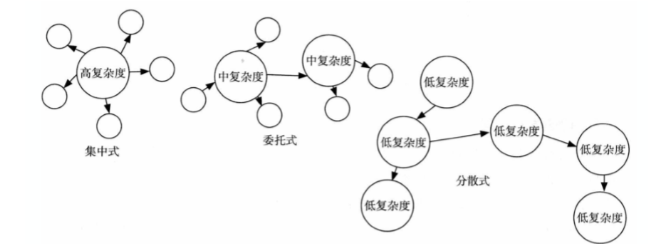

# 内聚和耦合

## 内聚

表达的是一个模块内部的联系的紧密性。

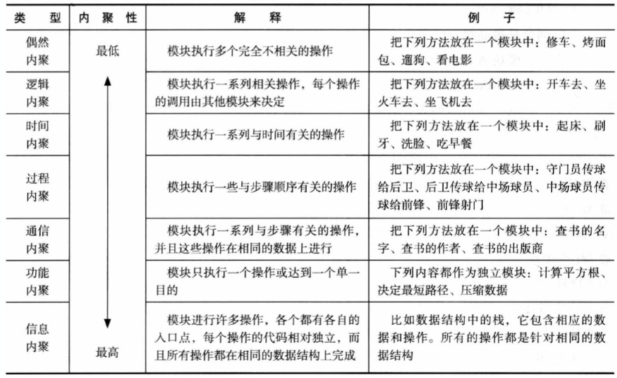


| 类型                 | 实例                                                         | 说明                                                         |
| -------------------- | ------------------------------------------------------------ | ------------------------------------------------------------ |
| 偶然内聚==不可接受== |  | 完全不相关                                                   |
| 逻辑内聚==不可接受== |  | 执行一系列操作，具体操作交给具体模块(如swtich)，解决控制耦合的方法 |
| 时间内聚             |        | 执行一系列和时间有关的操作，比如构造方法和析构方法           |
| 过程内聚             |        | 执行一系列与步骤顺序有关的操作                               |
| 通信内聚             |        | 执行一系列与步骤顺序有关的操作，并且这些操作是在相同的数据结构上。 |
| 功能内聚             |        | 模块只执行一个操作或达到一个单一目的                         |
| 信息内聚             |        | 模块进行许多操作，各自有各自的入口，相互独立，且在相同的数据结构上完成操作。 |

## 耦合

描述的是两个模块之间关系的复杂程度。

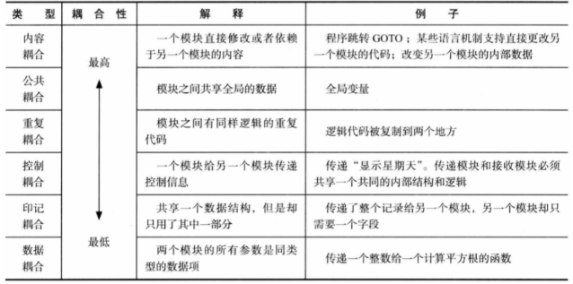

| 类型                     | 实例                                                         | 说明                                                         |
| ------------------------ | ------------------------------------------------------------ | ------------------------------------------------------------ |
| 数据耦合                 |        | 两个模块的所有参数是同类型的数据项(发送正好)                 |
| 印记耦合                 |                                   | 两个模块共享一个数据结构，但是只用了其中一个部分(发送多了)   |
| 控制耦合                 | 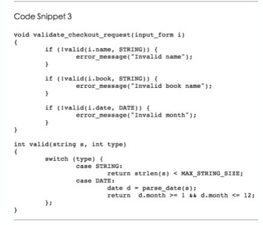                                  | 一个模块给另一个模块传递了控制信息(除了数据还有控制信号，并且违反了单一职责原则)主要是case中不应该出现具体实现的代码，应该抽象成方法 |
|                          |                                                              |                                                              |
| 重复耦合<br>==不可接受== | 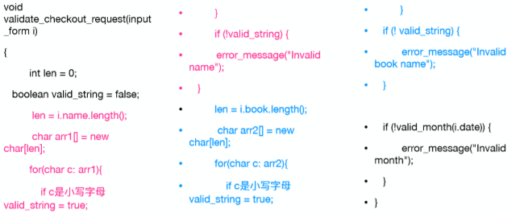 | 一个模块有逻辑上相同的重复代码                               |
| 公共耦合<br>==不可接受== |  | 模块之间共享全局数据结构                                     |
| 内容耦合<br>==不可接受== |                                                              | 一个模块直接修改另一个模块的内容(成员变量、函数等)           |

### 面向对象耦合

#### 隐式耦合

不设置局部变量，级联调用

#### 显示耦合

可以通过委托方式完成

#### 继承耦合

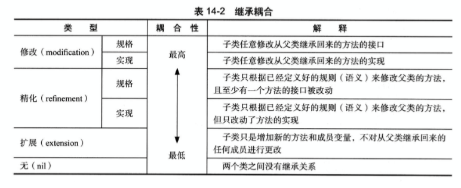

# KWIC的实现

1. MS:主程序子程序，分别调用
2. OO:职责和协作
3. Pipe Filter:数据进入过滤器，通过管理连接过滤器，每一个过滤器是独自运行的，多线程
4. Event:基于事件，订阅者和分发者

# 信息隐藏

## 定义

每一个模块都隐藏了这个模块中关于重要设计决策的实现，以至于只有这个模块的每一个组成部分才能知道具体的细节

## 基本思想

每个模块都隐藏了重要设计决策的实现，因此只有该模块的组成部分才知道详细信息：特别是如果存在所有可能的设计更改的列表-隐藏假设列表

##  秘密

### 主要秘密

主要秘密描述的是这个模块所要实现的**用户需求**。是设计者对⽤户需求的实现的⼀次职责分配。有了这个描述以后，我们可以利⽤它检查我们是否完成所有的⽤户需求，还可以利⽤它和需求优先级来决定开发的次序。

### 次要秘密

次要秘密描述的是模块在实现职责时候所涉及的具体的**实现细节**。包括数据结构，算法，硬件平台等信息。

##  两种常见的信息隐藏

### 根据需求分配的职责

实践表明，需求是经常变化的，频率和幅度都很大；

### 内部实现机制

常见的变化主题包括硬件依赖，输入输出形式，非标准语言特征和库，负责的设计和实现，复杂的数据结构，复杂的逻辑，全局变量。数据大小限制等。

# 设计原则汇总

## 原则一：全局变量是被认为是有害的

公共耦合是有风险，而且会增加潜在连接数量。

## 原则二：如果没有特殊要求，让代码清晰一点:

让代码兼顾明确和可修改性。

## 原则三：避免重复

面向接口编程，而不是重复地写逻辑上一致的代码。

## 原则四：面向接口编程

## 原则五：迪米特法则

1. 你可以自己玩。(this)
2. 你可以玩自己的玩具，但不能拆开它们(自己的成员变量)
3. 你可以玩送给你的玩具。(方法)
4. 你可以玩自己制作的玩具。(自己创建的对象)
5. 强调的是不能出现a.b.Methods这类情况，不能人去动狗的腿，而是人命令狗，狗动腿

## 原则六：接口隔离原则(ISP)/也叫接口最小化原则

1. 将大的接口拆解成几个小的接口。
2. 这样可以有效避免出现不必要的依赖。

## 原则七：里氏替换原则(LSP)

1. 所有派生类都必须可以替代其基类
2. 派生类的前置条件更弱，后置条件更强
3. 解决方案:在父类中添加方法或者函数，或者拆分接口


- 应该分为Door和Alerm两个接口，第一个CommonDoor不应该实现alerm

## 原则八：组合代替继承

MyStack 组合 Vector

## 原则九：单一职责原则:一个类只能有一个改变的理由

## 原则十：最小化类和成员的可访问性(x是可见)

- 是不是需要public
- 类声明前没有public，则包内可见
- 方法生命前没有public，则包内可见
- public修饰是全局可见


## 原则十一：开放/封闭原则(OCP)

1.  对扩展开放：模块的行为可以被扩展，比如新添加一个子类
2.  对修改关闭：模块中的源代码不应该被修改
3.  RTTI(运行时类型信息违反了开闭原则LSP)，就是如果都有的话则抽象成基类的方法。

## 原则十二：依赖倒置原则(DIP):高级模块不应依赖于低级模块：两者都应依赖抽象。

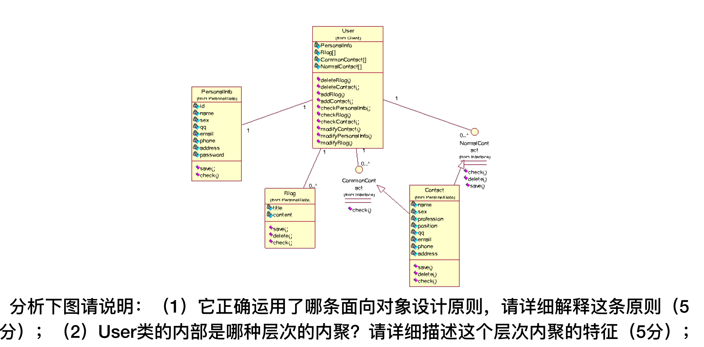

## 内聚耦合度量（了解）

- `对象类之间的耦合`：

  CBO = 该类访问其他类的成员方法的数量 + 其他类的成员访问该类的成员方法的数量

- `数据抽象耦合`

  DAC = 统计一类包含的其他类的其他类的实例的数量，不包括继承关系带来的实例引用

- `输入耦合度` 

  Ca:在此类之外依赖于这类内部的类的数量

- `输出耦合度` 

  Ce:这个类中依赖于这个类的外部的类的数量

- `继承树的深度`

  DIT = 从节点到根的继承树

- `子类的数量`

  NOC = 一个类的直接子类的数量

- `类凝聚力` 

  LCOM

## 表驱动

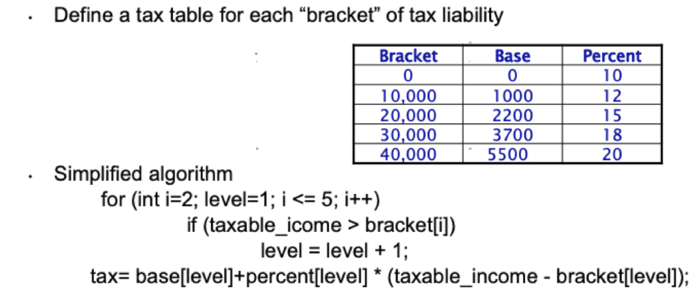

不是一定要你所想象的那个`方法表驱动`！

# 可修改性、可扩展性、灵活性

## 实现的**可修改性**

> 涉及到大的场景的修改

1. 对已有实现的修改
2. 例如：修改现有促销策略

## 实现的**可扩展性**(DIP & OCP)

1. 对新的实现的扩展
2. 例如：增加一条新的促销策略(策略模式)

## 实现的**灵活性**

1. 对实现的动态配置
2. 例如：动态修改更改某商品对应促销策略

# 设计模式

## 概述

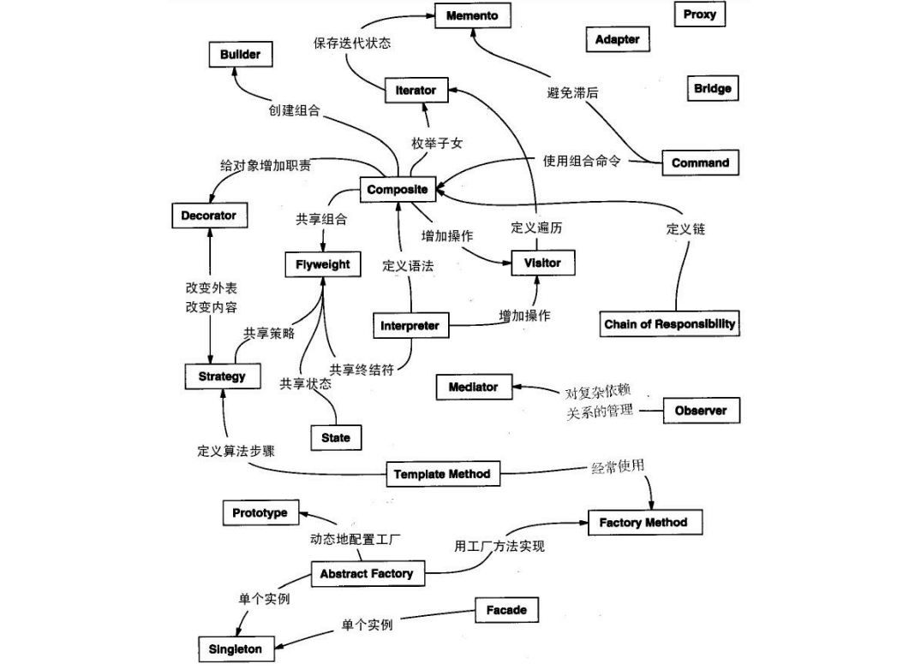

## 策略模式


在策略模式中，一个类的行为或其算法都可以在运行时改变。属**行为型模式**。

在策略模式中，我们创建表示各种策略的对象和一个行为随着策略对象改变而改变的context对象。策略独享改变context对象的执行算法。

### 上下文（Contex）: 

- 被配置了具体策略 ConcreteStrategy；
- 拥有Strategy对象的一个引用；
- 实现了一些方法以供Strategy访问其数据。

### 策略（Strategy）

声明了所支持策略的接口。 Context利用这些被ConcreteStrategy定义的接口。

#### 具体策略（ConcreteStrategy）

实现了Strategy声明 的接口，给出了具体的实现。

## 工厂模式

> 职责抽象、接口重用。


### 抽象工厂模式

在软件系统中，经常面临着“多种对象”的创建工作，由于需求的变化，多种对象的具体实现有时候需要灵活组合。比如汽车由引擎、轮胎、车身、车门等各部件组成。为每一种情况都新建一个工厂会导致“组合爆炸”问题。

所以，我们提供了两套接口： 

一是表现出稳定的工厂行为（创建不同的对象）的工厂接口；

二是表现出稳定产品行为的产品接口。从而，实现了工厂多态和产品多态。


### 工厂方法模式

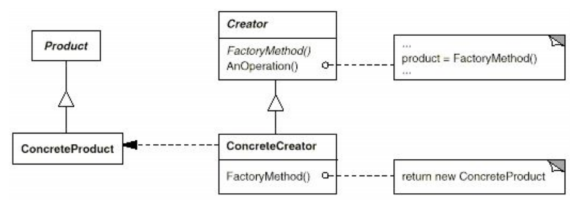

工厂接口可以通过抽象工厂模式的专门 的接口来实现，另外也 可以通过父类的工厂方法，来让子类继承相应 的工厂接口，这就是工 厂方法模式（Factory  Method Pattern）。

## 单件模式

> 信息隐藏、职责抽象。


这个东西的代码实现想必早已烂熟于心了吧？

## 迭代器模式

迭代器模式提供一种顺序访问一个聚合对 象的各个元素，而不暴露其内部表示。


对于$g()$的来说，往往可能只是希望挨个访问某个聚合结构。而且我们往往并不希望让$g()$知道到底是什么样的聚合结构，因此我们便引入了`迭代器模式`。

```java
for(iterator i = c.iterator(); i.hasNext();){
    do_something_with(i.next());
}
```


